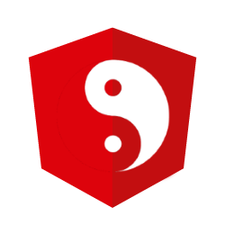

[](https://opensource.org/licenses/MIT)
[](https://www.npmjs.com/package/yang-schematics)
[](https://travis-ci.org/mselerin/yang-schematics)
[](https://codecov.io/gh/mselerin/yang-schematics)

# Yang Schematics
> Yet Another Angular Generator - Powered by Schematics



## Intro

The purpose of YANG is to create a more production-ready Angular application.

It use the Angular Schematics to generate the code.

YANG use the LIFT principle :
* Locating our code is easy
* Identify code at a glance
* Flat structure as long as we can
* Try to stay DRY (Don't Repeat Yourself) or T-DRY 

When generating a new Angular application with the Yang-Schematics, you have :

* A simple 4 modules structure : core, shared, layouts and features (see below)
* Lazy loading for all modules inside 'features'
* Sample bootstrap code
* Sample interceptor code
* i18n with [@ngx-translate](http://www.ngx-translate.com/)


### CoreModule

The CoreModule contains all the `@Injectable` elements that should be instantiate only once in the application.  

Ex: services, interceptors, etc.  

You can also add the modules with a `.forRoot()` method inside the `imports` array of the CoreModule.


### SharedModule

The SharedModule contains all elements (components, directives, pipes) that will be used accross the entire application.

Ex: a PageHeaderComponent, a security directive, etc.

You can also add the modules you want to use everywhere inside the `MODULES` array of the SharedModule.  
Then, you just have import the `SharedModule` inside your module.


### LayoutsModule

This module contains a `MainLayoutModule` where you can customise the application layout.  
You can also add others layout inside (for example, a LoginLayout).


### FeaturesModule

You can see a feature as a "business block" for your application.  
A good example would be an "admin feature" where you can have a component to manage the users, the configuration, etc.  

Each feature is lazy-loaded by default.  

You can create what you want inside a feature (a component, a directive, a module, another feature).


### Folder Structure
```
PROJECT_ROOT
│  ...
│  prebuild.js            <----------------- Script for generating "app-manifest.json" (version number and built date)
│  ...
│
├───e2e
└───src
   │  ...
   │  tsconfig.json
   │
   ├───app
   │  │  app-routing.module.ts    <------ Main routing
   │  │  app.component.spec.ts
   │  │  app.component.ts
   │  │  app.module.ts
   │  │
   │  ├───core                            
   │  │  │  core.initializer.ts   <------ Code to execute when the application starts
   │  │  │  core.interceptors.ts  <------ HttpClient interceptors (rewrite /api/ to the api url inside environment config file)
   │  │  │  core.module.ts
   │  │  │  core.services.ts     <------- Module pour regrouper tous les services
   │  │  │
   │  │  └───services
   │  │        config.service.ts  <------ Load assets/config/app-config.json and expose an AppConfig object
   │  │        logger.service.ts  <------ Logging that can send error to a server
   │  │
   │  ├───features
   │  │  │  features.module.ts
   │  │  │
   │  │  └───home
   │  │       home-routing.module.ts
   │  │       home.component.spec.ts
   │  │       home.component.ts
   │  │       home.module.ts
   │  │  
   │  ├───layouts
   │  │
   │  ├───models
   │  │     app-config.model.ts  <------- See assets/config/app-config.json
   │  │
   │  └───shared
   │     │  shared.module.ts    <-------- Shared modules (where you can add 3rd party modules)
   │     │
   │     ├───components
   │     └───pipes
   │
   ├───assets                <----------- Assets folders (images, styles, etc)
   │  ├───config
   │  │     app-config.json
   │  │
   │  ├───i18n
   │  ├───images
   │  └───styles
   │        app-styles.scss
   │        _variables.scss
   │
   └───environments            <--------- Environnements configuration
        environment.prod.ts
        environment.ts
``` 


## Installation
Install Yang-Schematics using [npm](https://www.npmjs.com/) `npm install -g yang-schematics`.


## Usage
Generate your new project inside any folder:

```bash
ng new my-awesome-project -c yang-schematics
```

This will create a new folder `my-awesome-project` containing a fresh Angular application, powered with the YANG structure. 

Next : install dependencies and run the project :
```bash
cd my-awesome-project
npm install
npm run start
```

Browse to http://localhost:4200.
That's all !


## Schematics

*The default schematics for this project is 'yang-schematics'.  
If you have changed it, don't forget to append `yang-schematics:` before every schematic call.*

### Feature
`ng g feature my-super-feature` (or `ng g f...`)  
Generates a feature under app/features with an empty component. 

To skip the component generation, use : `ng g feature foo --component=false` or `ng g f foo -c=false`

##### Options
* `--component` : Create a 'my-super-feature' component. Options from the 'component' schematic are available. (default: true)


***
### Component
`ng g component my-nice-component` (or `ng g c...`)  
Generates a component under the current directory.

`ng g component shared/my-shared-component`  
Generates a component under `app/shared/components`.

`ng g component my-super-feature/my-feature-component`  
Generates a component under `app/features/my-super-feature/my-feature-component`.

##### Options
* `--routing` : Specifies if a route should be generated for this component
* `--route <name>` : Specifies the name of the route to generate


***
### Service
`ng g service my-cool-service` (or `ng g s...`)  
Generates a service under app/services.

***
### Directive
`ng g directive my-small-directive` (or `ng g d...`)  
Generates a stub directive under app/shared/directives.

***
### Pipe
`ng g pipe my-nice-pipe` (or `ng g p...`)  
Generates a pipe under app/shared/pipes.


***
### Proxy
`ng g proxy`  
Generates a simple proxy configuration inside your project.  
(more info: [Angular documentation](https://angular.io/guide/build#proxying-to-a-backend-server))


***
### Jest
`ng g jest`  
Replace [Karma](https://karma-runner.github.io) by [Jest](https://jestjs.io/) without changing your unit-tests.  
Your `npm run test` and `ng test` commands still work but now, you can also use `npm run jest:watch`.


***
### I18N
`ng g i18n`  
Add [@ngx-translate/core](https://github.com/ngx-translate/core) to the project.  


## License
MIT


[npm-image]: https://badge.fury.io/js/yang-schematics.svg
[npm-url]: https://npmjs.org/package/yang-schematics
[travis-image]: https://travis-ci.org/mselerin/yang-schematics.svg?branch=master
[travis-url]: https://travis-ci.org/mselerin/yang-schematics
[daviddm-image]: https://david-dm.org/mselerin/yang-schematics.svg?theme=shields.io
[daviddm-url]: https://david-dm.org/mselerin/yang-schematics
